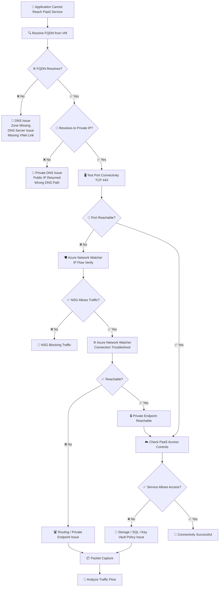

# 🚨 Private Endpoint Connectivity Decision Tree

```mermaid
flowchart TD

A["🚨 Application Cannot Reach PaaS Service"] --> B["🔍 Resolve FQDN from VM"]

B --> C{"🌐 FQDN Resolves?"}

C -->|❌ No| D["📛 DNS Issue<br/>Zone Missing<br/>DNS Server Issue<br/>Missing VNet Link"]

C -->|✅ Yes| E{"📍 Resolves to Private IP?"}

E -->|❌ No| F["📛 Private DNS Issue<br/>Public IP Returned<br/>Wrong DNS Path"]

E -->|✅ Yes| G["🖥️ Test Port Connectivity<br/>TCP 443"]

G --> H{"🔌 Port Reachable?"}

H -->|❌ No| I["🛡️ Azure Network Watcher<br/>IP Flow Verify"]

H -->|✅ Yes| J["☁️ Check PaaS Access Controls"]

I --> K{"✅ NSG Allows Traffic?"}

K -->|❌ No| L["🚫 NSG Blocking Traffic"]

K -->|✅ Yes| M["🌐 Azure Network Watcher<br/>Connection Troubleshoot"]

M --> N{"✅ Reachable?"}

N -->|❌ No| O["🛣️ Routing / Private Endpoint Issue"]

N -->|✅ Yes| P["🔒 Private Endpoint Reachable"]

P --> J

J --> Q{"✅ Service Allows Access?"}

Q -->|❌ No| R["🚫 Storage / SQL / Key Vault Policy Issue"]

Q -->|✅ Yes| S["🎉 Connectivity Successful"]

O --> T["📦 Packet Capture"]

R --> T

T --> U["🔬 Analyze Traffic Flow"]
```